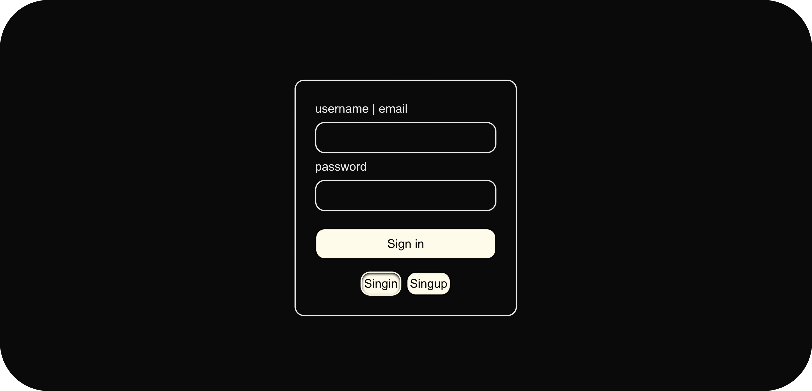

<h1 align="center">Authentication - Login</h1>
<p align="center">  Simple Authentication - Login UI built with Next.js and MongoDb.</p>

<br/>
<br/>

## Description
This is a simple mini project built with Next.js and MongoDB that implements user authentication, allowing users to sign up, sign in, and sign out. It uses MongoDB to store user data and Next.js API routes for the backend logic, providing a basic authentication system that can be extended for larger applications.


<br/>

## Features
- User authentication system (Sign Up, Sign In, Sign Out)
- Password hashing for secure credential storage
- MongoDB database integration for user data management
- Next.js API routes for backend authentication logic
- Form validation for user inputs
- Clear success and error messages for better user experience
  
<br/>

## Screenshots
###### Desktop


<br/>

## Tech Stack
- React.js
- Next.js
- MongoDB
  
<br/>

## Installation & Usage
###### Requirements 
- Node.js
- npm or yarn
###### Installation Steps 
1. Clone the project 
```bash
git clone https://github.com/Kaveh-Khorshidi/Coffee-Shop.git
```
2. Move into the project directory
```bash
cd Coffee-Shop
```
3. Install dependencies
```bash
npm install
```
###### Usage Steps
Start the development server
```bash
npm run dev
```

<br/>

 
## Project Goals
- Improve frontend development skills
- Learn mongoDB
- learn Authentication
  
    

<br/>

## Author

**Kaveh Khorshidi**

[](https://github.com/kavehkhorshidiii)

[](mailto:kavehkhorshidiii@gmail.com)
